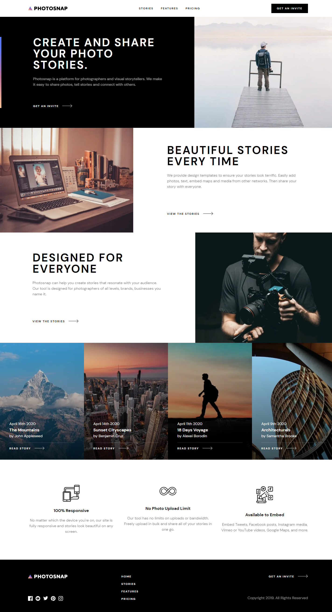

# Frontend Mentor - Photosnap Website solution

This is a solution to the [Photosnap Website challenge on Frontend Mentor](https://www.frontendmentor.io/challenges/photosnap-multipage-website-nMDSrNmNW). Frontend Mentor challenges help you improve your coding skills by building realistic projects. 

## Overview

### The challenge

Users should be able to:

- View the optimal layout for each page depending on their device's screen size
- See hover states for all interactive elements throughout the site

### Screenshot

### Links

- [Frontend Mentor: Solution URL](https://www.frontendmentor.io/solutions/photosnap-website-with-nextjs-and-tailwind-SKccHT_g2)
- [Vercel: Live Site URL](https://photosnap-psi.vercel.app/)

## My process

### Built with

- [React](https://reactjs.org/) - JS library
- [Next.js](https://nextjs.org/) - React framework
- Tailwind CSS

### What I learned

My focus for this project was to learn page routes in Next.js and to reinforce my understanding of building react components with Tailwind CSS styles. There were also limitations with next/images that I had to work around. This project helped me get really deep into the Next.js docs to understand how images are rendered and optimized.

### Continued development

I plan to learn more about `grid-area` and pulling data from a local JSON file, so there are some other projects I'm thinking of completing next. I've been getting really comfortable creating components and putting components together to build a webpage, and I want to build more complex features with a lot of moving parts (Maybe with React Redux).

## Author

Ian Wu

- Frontend Mentor - [@iannnop](https://www.frontendmentor.io/profile/iannnop)
- LinkedIn - [@iannnop](https://www.linkedin.com/in/iannnop/)
- Instagram - [@ian.wuu](https://www.instagram.com/ian.wuu/)
- Twitter - [@iannnop](https://www.twitter.com/iannnop)
